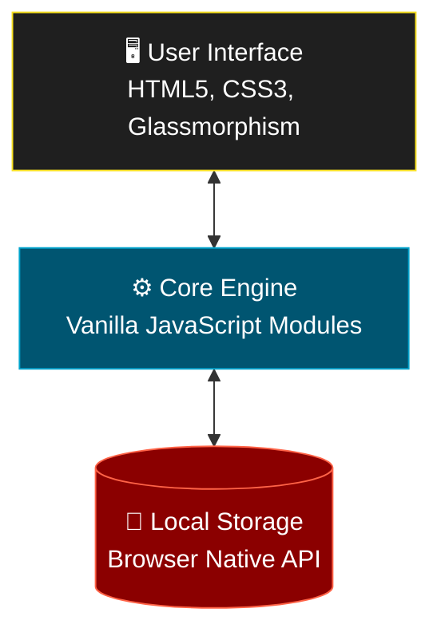

<div align="center">
  
  
  <h1>🌌 StudySphere</h1>
  <p><strong>Premium Gamified Student Productivity Companion</strong></p>

  <p>
    <a href="#-features"><b>Features</b></a> •
    <a href="#-quick-start"><b>Quick Start</b></a> •
    <a href="#-architecture"><b>Architecture</b></a>
  </p>

  <p>
    
    
    
    
  </p>
</div>

---

## 🌟 About StudySphere

**StudySphere** is the ultimate, 100% serverless academic companion designed to level up your entire academic journey. Featuring a highly aesthetic, state-of-the-art glassmorphism UI, StudySphere keeps you focused, tracks your insights, and rewards your progress through a unified gamified ecosystem. 

Because it's completely serverless, **your data stays entirely private inside your browser!**

---

## 🔥 Gamified Features

| Module | Description |
| :--- | :--- |
| **🎮 Gamified Dashboard** | Earn XP, track daily goals, maintain streaks, and unlock profile achievements. |
| **🎧 Deep Focus Study Room** | A distraction-free zone featuring a Pomodoro timer and integrated Lo-Fi/Ambient audio controls. |
| **📓 Knowledge Base (Notes)** | Write, store, and manage your academic notes with seamless local storage integration. |
| **✅ Smart Task Manager** | Filterable to-do list integrated right into your core study loop. |
| **🌐 Community Circles** | Join groups to chat and share academic goals via an intuitive messaging interface. |

---

## 🏗 Serverless Architecture

StudySphere leverages pure frontend technologies, operating 100% statically in the browser for maximum speed and privacy:



---

## 🚀 Quick Start

Since StudySphere is completely static and serverless, getting started takes literally seconds.

### 1. Requirements
- A modern web browser (Chrome, Edge, Firefox, Safari).

### 2. Launching The App
Clone the repository and jump straight in!
```bash
git clone https://github.com/shivayBadmoss/study_sphere.git
cd study_sphere/frontend
```
Open `index.html` in your favorite web browser—no servers, dependencies, or compilers needed!

---

## 📁 Directory Structure

```text
study_sphere/
├── frontend/
│   ├── index.html        # Main Entry Point & App Layout
│   ├── css/
│   │   └── style.css     # Glassmorphism & UI Animations
│   └── js/
│       ├── main.js       # Core initialization
│       ├── auth.js       # Local authentication & sessions
│       ├── tasks.js      # Task tracking logic
│       ├── notes.js      # Notes system handling
│       ├── timer.js      # Focus room Pomodoro logic
│       ├── ...           # Additional modular scripts
└── README.md             # You are here!
```

---

<div align="center">
  <p>Built with ❤️ by <a href="https://github.com/shivayBadmoss">Shivay Agarwal</a></p>
</div>
